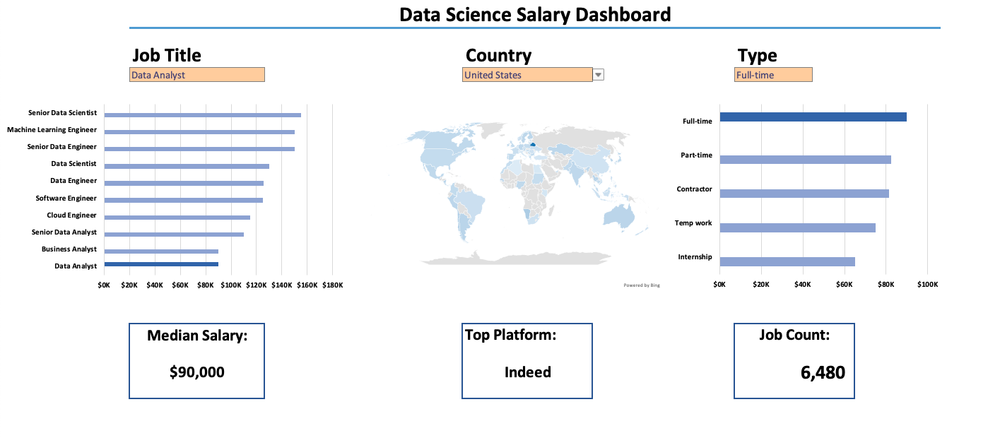

# Salary Dashboard (Excel)

## Overview
This project showcases a fully interactive **Salary Dashboard** built in Microsoft Excel. It analyses job salaries across titles, job types, and countries, and presents insights through dynamic KPIs and clean visualisations. The dashboard reflects real business reporting standards and demonstrates my ability to build end‑to‑end analytical workflows.

**Dataset:** 32,000+ real job postings sourced from 2023 job market data

---

## File Structure
The workbook is organised into a single dashboard supported by several backend sheets:

- **Dashboard** – Main interface with KPIs, charts, and filters  
- **title** – Median salary and job count calculations  
- **type** – Job type salary logic and highlight rules  
- **platform** – Platform extraction, cleaning, and ranking  
- **data_validation** – Dropdown lists, named ranges, and selected values  
- **jobs** – Cleaned dataset used for all calculations  

All backend sheets are hidden in the final version to protect formulas and maintain a clean user experience.

---

## Key Insights Delivered
- Median salary for the selected job title  
- Top hiring platform  
- Total job count  
- Salary distribution across job types  
- Country‑level salary comparison  

---

## How the Dashboard Works
The dashboard is powered by structured backend logic and dynamic Excel formulas, including:

`XLOOKUP`, `FILTER`, `SORT`, `UNIQUE`, `SUBSTITUTE`, `MEDIAN`, `COUNT`

User selections from dropdown menus automatically update all KPIs and charts through named ranges and linked formulas.

---

## Design & Formatting
To ensure a clean, professional look:

- Gridlines removed  
- Chart outlines removed  
- Consistent heading styles applied  
- Blue‑themed visual identity  
- Elements aligned and spaced for clarity  

---

## Protection & Final Touches
To make the dashboard safe and user‑friendly:

- Only input cells (dropdowns) unlocked  
- All backend sheets hidden  
- Dashboard protected with **“Select unlocked cells”** enabled  

---

## How to Use This Dashboard
1. **Select a Job Title**  
   Choose a role (e.g., Data Analyst, Data Scientist) from the dropdown.

2. **Select a Country**  
   The map and KPIs update automatically.

3. **Select a Job Type**  
   The job type chart highlights the selected category.

4. **Review KPIs**  
   - Median Salary  
   - Top Hiring Platform  
   - Job Count  

5. **Explore Charts**  
   Compare salaries across job types and countries to understand market trends.

The dashboard is fully interactive — every selection updates the insights instantly.

## Skills Demonstrated
- Advanced Excel formulas — `XLOOKUP`, `MEDIAN(IF())`, `FILTER`, `SORT`, `UNIQUE`  
- Data validation and named ranges for interactive filtering  
- Multi‑sheet workbook architecture with protected logic  
- Dashboard UI design — layout, colour consistency, user experience  
- Translating raw data into business‑ready insights  
